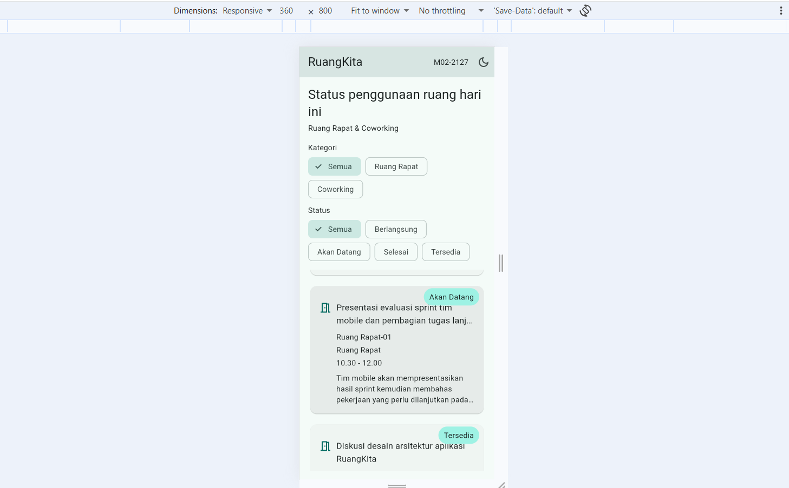
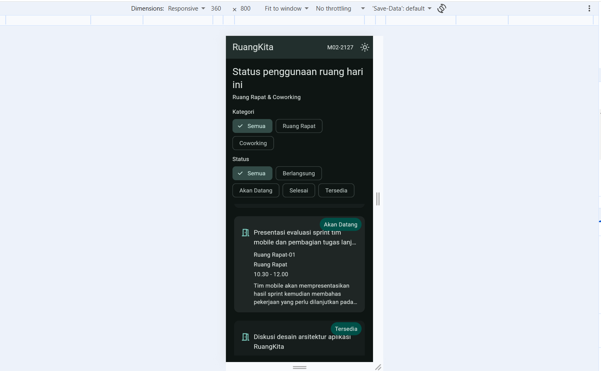

# RuangKita - Modul 02

## Identitas
Nama: Mohammad Salim
NIM: 362558302127
Mata Kuliah: Pemrograman Perangkat Bergerak
Modul: Modul 02 - Declarative UI & Responsive Layout
Kode UI: M02-2127

## Varian Aplikasi
Digit terakhir NIM = 7, jadi varian tugas yang digunakan adalah Ruang Rapat & Coworking.
Aplikasi RuangKita menampilkan status penggunaan ruang pada hari ini menggunakan data lokal.

## Struktur File
```
lib/
├── main.dart
├── models/
│   └── room_session.dart
└── modul02/
    └── studi_kasus/
        └── ruang_praktikum.dart
```

## Arsitektur Widget
Struktur utama halaman:

```text
RuangKitaApp
└── MaterialApp
    └── RuangPraktikumPage
        └── Scaffold
            ├── AppBar
            │   ├── RuangKita
            │   ├── M02-2127
            │   └── Dark Mode Button
            │
            └── LayoutBuilder
                └── Column
                    ├── Header
                    ├── Wrap + ChoiceChip kategori
                    ├── Wrap + ChoiceChip status
                    └── ListView / GridView
                        └── Stack
                            ├── Card
                            │   └── Row
                            │       └── Expanded
                            │           └── Column
                            │               └── Text
                            └── Positioned
                                └── Status Badge
```

Halaman utama menggunakan StatefulWidget karena filter kategori, filter status, dan interaksi halaman memerlukan state yang dapat berubah selama aplikasi berjalan.

## Data
Aplikasi menggunakan minimal 8 record lokal dengan 4 nama ruang berbeda dan status Berlangsung, Akan Datang, Selesai, serta Tersedia.
Data dipisahkan ke dalam class `RoomSession` agar tidak ditulis berulang di dalam widget card.

## Responsive Testing
### Mobile Light


### Tablet


### Expanded


### Dark Mode


## Git Commit
Repository menggunakan beberapa commit bertahap untuk menunjukkan proses pengerjaan.

Commit utama:
```text
feat(m02): add room session model + dummy data
feat(m02): build compact room cards UI mobile 1 column
feat(m02): add responsive breakpoints LayoutBuilder medium/expanded
feat(m02): add filters and bottom sheet setState + interaction
fix(m02): handle overflow and dark theme
docs(m02): add README debug notes
```

Commit final:
https://github.com/mohammadsalim2908/ruangkita.git

## Refleksi Teknis

### 1. Mengapa Expanded membantu Text di dalam Row?
`Expanded` memberikan batas ruang kepada Text sesuai ruang yang tersedia di dalam Row. Tanpa Expanded, Text dapat mengambil ukuran yang terlalu besar sehingga menyebabkan RenderFlex overflow.

### 2. Mengapa LayoutBuilder lebih tepat untuk layout lokal dibanding hanya MediaQuery?
LayoutBuilder memberikan constraints dari parent langsung kepada widget yang sedang dibangun. Karena tugas ini mengubah susunan card berdasarkan lebar area parent, `constraints.maxWidth` dapat digunakan untuk menentukan layout 1, 2, atau 3 kolom.

### 3. Apa yang berubah pada widget tree ketika setState dipanggil?
Ketika state berubah melalui setState, State widget dijadwalkan untuk build ulang. Widget yang bergantung pada nilai state kemudian menghasilkan tampilan baru, misalnya daftar room berubah berdasarkan filter yang dipilih.
